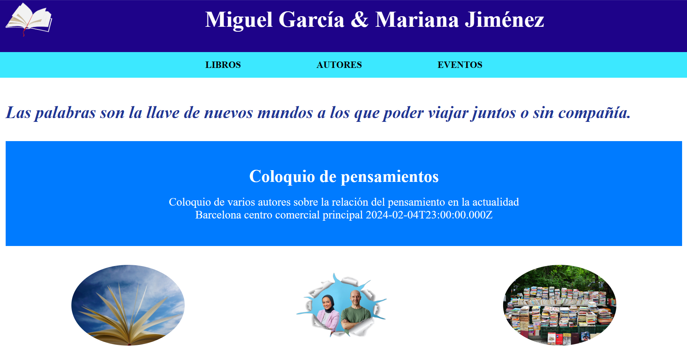
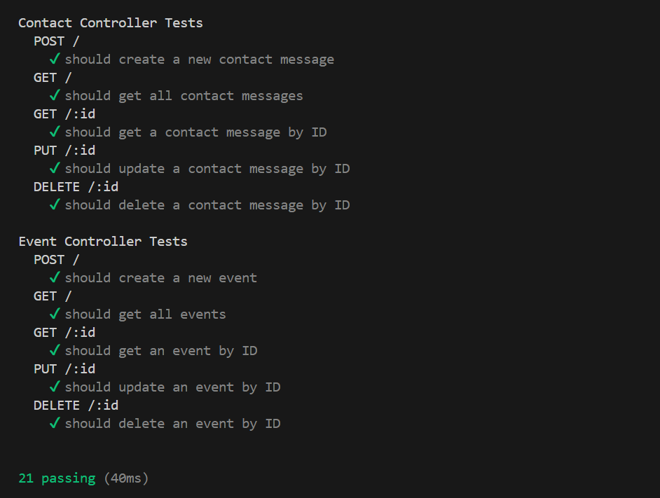

# webautores

Proyecto innovador de **Miguel García & Mariana Jiménez**, enfocado en presentar y dar a conocer una web de dos autores donde suben sus libros y eventos. Toda la información es ficticia.



## Tabla de Contenidos

- [Instalación](#instalación)
- [Uso](#uso)
- [Desarrolladores](#desarrolladores)
- [Licencia](#licencia)

## Estado del Proyecto
🚧El proyecto se encuentra en estado de construcción 🚧.

## Instalación
💻

Al instalarse el proyecto en la consola se deben tener en cuenta las siguientes indicaciones: <br>
- Se debe instalar Node.js en el ordenador: ```npm install```
- Dentro de la carpeta **client** debemos escribir en la terminal:
```npm start```
- Dentro de la carpeta **server** debemos escribir en la terminal: ```nodemon app```
- Ambos códigos deben estar en diferentes terminales corriendo para poder ser usado el proyecto.


## Uso

Teniendo en cuenta la anterior información se podría navegar por todas las páginas de manera libre. 

## Créditos

### Desarrolladores:
- Natalia [Linkedin](https://www.linkedin.com/in/natalia-de-bustos-garc%C3%ADa-5ba965298/)


## Tecnologías utilizadas

 
 
 


## Metodologías Ágiles
- <a href="https://trello.com/invite/b/Odq08HL7/ATTIc290e7077381ef7078e452d4e2a6554e64C4AC5B/web-autores"> Trello </a> </br> 
- <a href="https://www.figma.com/file/4HxMQ9QQhXUo9taj4OJRXO/Authors?type=design&node-id=7%3A2&mode=design&t=3B0r51SKjjfF9tHU-1"> Figma </a> </br>
- <a href="https://github.com/natalia9519/webautores.git">GitHub</a> </br>
- <a href="https://webautores-5ky3.vercel.app/">Deploy</a>

## Licencia

Este proyecto está bajo la Licencia [CCO](LICENSE).

Las fuentes utilizadas en este proyecto estan sujetas a licencia SIL con Copyright &copy; 2014, Indian Type Foundry (info@indiantypefoundry.com)

## Test 

Se han hecho varios test para el backend para el controlador auth.controller, bookController, eventController y commentController.


## Auditoria de la página
Documento drive <a href="https://drive.google.com/file/d/1j24be0_l-XN2DgNLuEJHKNor_WGTlaqV/view?usp=sharing">Auditoria</a>
